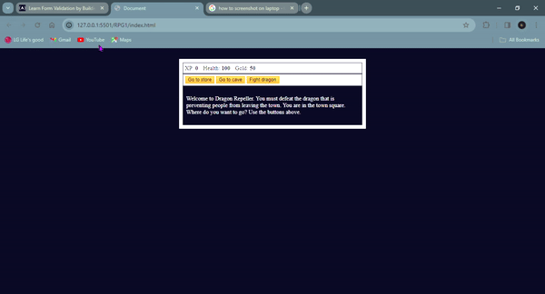

# 🐉 Dragon Repeller 🛡️

Welcome to Dragon Repeller, a text-based RPG where you embark on a perilous journey to save the town from a fearsome dragon. Developed with HTML, CSS, and JavaScript, this game is a fun exploration of web development fundamentals, inspired by the educational content from FreeCodeCamp.

# 🎮 Game Features

Explore different locations such as the town square, a mysterious cave, and a dangerous dragon's lair.
Combat various monsters including slimes, fanged beasts, and the ultimate dragon.
Shop for weapons and health potions to bolster your chances of survival.
Manage your health, experience, and gold to strategize your next move.

## 🚀 Getting Started

To play the game, simply clone this repository to your local machine and open the ` index.html ` file in your preferred web browser.

``` bash
git clone <https://github.com/Lawani-EJ/RPG-Game-Prototype1.git>
cd dragon-repeller
open index.html
```

## 📖 Instructions

Use the buttons on the screen to make choices and interact with the world.
Keep an eye on your stats (XP, Health, Gold) to ensure your survival.
Visit the store to buy essential items or upgrade your weapon.
Choose your battles wisely and fight to earn XP and gold.
Defeat the dragon to win the game!

# 🛠️ Built With

HTML - For structuring the game content.
CSS - For styling the game interface.
JavaScript - For game logic and interactivity.

# 📸 Screenshots and Screen Recording

## Screenshots

.png)

## Screen Recording



## 📚 Learning Journey

This project was built as a learning exercise in web development, inspired by the comprehensive tutorials available at FreeCodeCamp. It served as a practical application of HTML, CSS, and JavaScript fundamentals.

# 🙏 Acknowledgments

FreeCodeCamp - For providing an excellent platform to learn web development.
All the open-source contributors and educators who make learning web development accessible to everyone.

## 📄 License

This project is licensed under the MIT License - see the LICENSE.md file for details.

